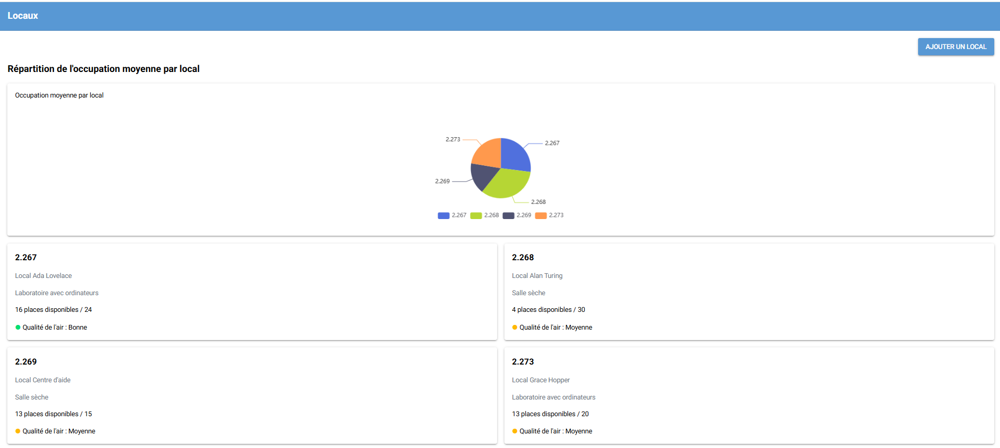
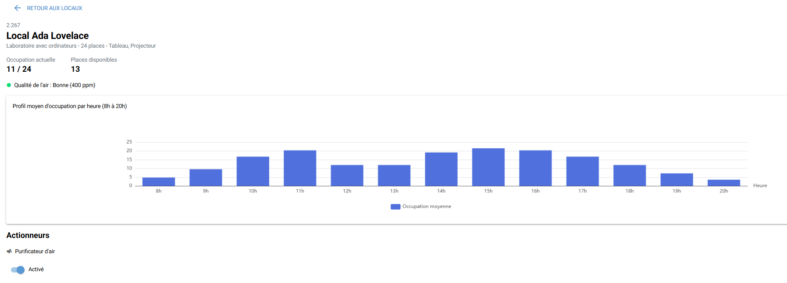
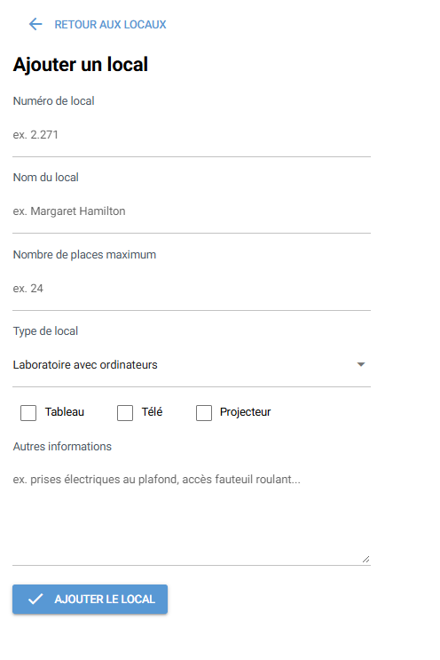

# Instructions
- Examen de 2 heures sur la totalité de la durée du cours (3h).
- Aucune intelligence artificielle permise. En cas de doute, l'enseignante pourrait vous convoquer dans les 2 prochaines semaines pour expliquer votre travail ou vous réévaluer le cas échéant.
- Faites une copie indépendante de ce projet (Use this templace), donnez moi les droits d'accès et clonez votre projet.
- Remise sur classroom : 
    - Vous devez me remettre le lien de votre projet github dans classroom.
    - Vous devez obligatoirement faire une dernière remise avant votre départ.

# Gestion des locaux
Il s'agit d'une application de suivi et de gestion des locaux, connectée à des capteurs simulés. Elle permet de visualiser en temps réel l'occupation et la qualité de l'air de chaque local, et d'allumer ou éteindre à distance le purificateur d'air associé.

- **`api_locaux`** : API FastAPI exposant les locaux, leur état (occupation, qualité de l'air, purificateur) et leur historique d'occupation par horaire simulé.
- **`app_locaux`** : Application web qui consomme l'API.

# Exigences fonctionnelles :
- La page d'accueil affiche 
    - un graphique en secteurs de l'occupation moyenne par local;
    - une grille montrant les locaux avec leur occupation actuelle, la qualité de l'air et l'état du purificateur. Celles-ci doivent être rafraîchies automatiquement toutes les 10 minutes;
    - chaque carte mène à la page de détail du local correspondant;
    - un bouton qui permet d'ajouter un nouveau local.

- La page de détails d'un local affiche 
    - les informations du local (nom, type, capacité, équipements disponibles), l'occupation actuelle et les places disponibles, un indicateur de qualité de l'air. Ces 3 dernières doivent être rafraîchies automatiquement;
    - un graphique à barres du profil moyen d'occupation par heure (8h-20h);
    - un interrupteur pour activer ou désactiver le purificateur d'air. La qualité doit se mettre à jour en conséquences.

- Un formulaire de création d'un nouveau local : numéro, nom, nombre de places maximum, type de local (laboratoire avec ordinateurs ou salle sèche), équipements (tableau, télé, projecteur) et autres informations libres. 
    - Des messages d'erreur doivent s'afficher lorsque les valeurs ne sont pas valides.

# Exigences techniques
- L'environnement de développement doit être reproductible.

# Question
- Complétez l'application de façon à répondre à toutes les exigences.
- Expliquez comment se fait la validation des données dans votre application (répondez ici).
    * Numéro :  Je vérifie si le numréro est entre 2.67 et 2.273, mais ça ne fonctionne pas bien
    * Nom : Je vérifie la longueur. Elle doit être plus grande que 5 et inférieure à 30
    * Commentaire : Je vérifie que sa longueur n'est pas plus longue que 200 charactères.
- Ajoutez une capture d'écran montrant la struture de votre projet.

# ANNEXE 

